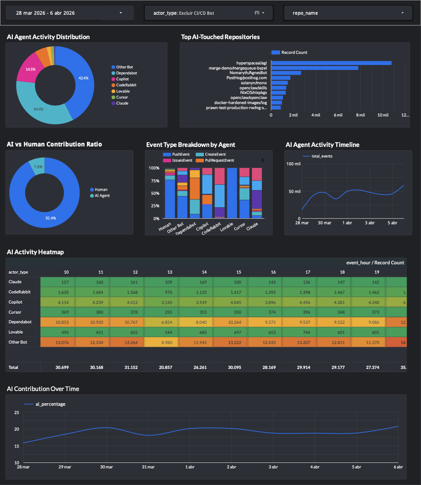

# GitHub Activity Batch Pipeline

**DE Zoomcamp 2026 Final Project**

A batch processing pipeline analyzing **AI coding agent contributions** on GitHub. Ingests GitHub Archive data via Airflow, stores in BigQuery (partitioned/clustered), transforms with dbt, and visualizes in Looker Studio.

---

## Quick Start

### Prerequisites
- Docker + Docker Compose
- Terraform >= 1.0
- gcloud CLI + GCP project with billing enabled
- Python 3.12+ (for dbt)

### 1. Configure Environment

```bash
# Create service account and download key
gcloud iam service-accounts create github-activity-pipeline
gcloud projects add-iam-policy-binding YOUR_PROJECT_ID \
  --member="serviceAccount:github-activity-pipeline@YOUR_PROJECT_ID.iam.gserviceaccount.com" \
  --role="roles/bigquery.admin"
gcloud projects add-iam-policy-binding YOUR_PROJECT_ID \
  --member="serviceAccount:github-activity-pipeline@YOUR_PROJECT_ID.iam.gserviceaccount.com" \
  --role="roles/storage.admin"
gcloud iam service-accounts keys create keys/gcp-creds.json \
  --iam-account=github-activity-pipeline@YOUR_PROJECT_ID.iam.gserviceaccount.com
```

### 2. Create `.env` File

```bash
cat > .env << EOF
GOOGLE_CLOUD_PROJECT=YOUR_PROJECT_ID
GOOGLE_APPLICATION_CREDENTIALS=/absolute/path/to/keys/gcp-creds.json
AIRFLOW_UID=50000
AIRFLOW__CORE__FERNET_KEY=$(python3 -c "from cryptography.fernet import Fernet; print(Fernet.generate_key().decode())")
EOF
```

### 3. Deploy Infrastructure

```bash
make terraform-init
make terraform-apply PROJECT_ID=YOUR_PROJECT_ID
```

### 4. Start Airflow

```bash
make airflow-up
# Wait 2 minutes, then access: http://localhost:8080 (admin/admin)
```

### 5. Set Up dbt

```bash
# Create virtual environment for dbt (separate from Airflow which runs in Docker)
python3 -m venv .venv
source .venv/bin/activate
pip install -r requirements.txt  # Installs dbt-bigquery + pytest
```

**Note:** Airflow runs in Docker with the official `apache/airflow:2.8.0` image.
The `requirements.txt` is for local dbt transformations and testing only.

### 6. Run Pipeline

1. **Trigger Airflow DAG:**
   - Open http://localhost:8080
   - Toggle `github_activity_batch_pipeline` DAG to **Active**
   - Click **Play** → **Trigger DAG w/ config** → set `execution_date` (e.g., `2026-03-28`)
   - Each run downloads 24 hours of data (~5 min)

2. **Run dbt transformations:**
   ```bash
   make dbt-build   # Runs: deps + run + test
   ```

3. **Verify data:**
   ```bash
   bq query --use_legacy_sql=false \
     "SELECT event_date, COUNT(*) as events
      FROM github_activity.github_events
      GROUP BY event_date ORDER BY event_date"
   ```

---

## Architecture

```
GitHub Archive → Airflow (Docker) → GCS → BigQuery → dbt → Looker Studio
```

| Component | Technology |
|-----------|------------|
| Orchestration | Apache Airflow 2.8.0 (Docker Compose) |
| Storage | GCS + BigQuery (partitioned by day, clustered by repo/actor/type) |
| Transformation | dbt (1 staging + 3 marts) |
| Visualization | Looker Studio |

---

## Pipeline Workflow

### Airflow DAG (6 tasks)

```
download_github_archive → upload_to_gcs → validate_data_quality → transform_data → load_to_bigquery → cleanup_temp_files
```

| Task | Description |
|------|-------------|
| download_github_archive | Downloads GitHub Archive JSON for specified date (24 hours) |
| upload_to_gcs | Uploads raw data to GCS |
| validate_data_quality | Validates JSON structure and required fields |
| transform_data | Transforms to BigQuery-compatible schema (~50k records/hour) |
| load_to_bigquery | Loads to partitioned BigQuery table |
| cleanup_temp_files | Removes temporary files |

**Note:** DAG runs in TEST_MODE (50k records per file) for faster execution. See `airflow/dags/github_activity_pipeline.py` for production configuration.

---

## dbt Transformations

After Airflow loads data, run dbt to create analytics models:

```bash
make dbt-build   # deps + run + test
```

**Models created:**

| Model | Type | Description |
|-------|------|-------------|
| `stg_github_events` | View | Cleaned events with quality flags |
| `daily_stats` | Table | Daily aggregated metrics |
| `repo_health` | Table | Repository health scores |
| `ai_agent_stats` | Table | AI agent activity analytics |

Verify: `bq query "SELECT * FROM github_activity.ai_agent_stats LIMIT 10"`

---

## Dashboard Setup

### Looker Studio

1. Go to https://lookerstudio.google.com/
2. Create → Report → BigQuery connector
3. Select: `YOUR_PROJECT_ID.github_activity.ai_agent_stats`

**Dashboard Visualizations (7+ charts):**

| Visualization | Type | Data Source | Metrics |
|--------------|------|-------------|---------|
| Key Metrics | Score Cards (4) | ai_agent_stats | Total AI Events, Unique Agents, Repos Touched, AI Ratio |
| AI Agent Activity | Donut | ai_agent_stats | actor_type, SUM(total_events) |
| Agent Timeline | Line | ai_agent_stats | stats_date, SUM(total_events) by actor_type |
| Top AI-Touched Repos | Bar | stg_github_events | repo_name, COUNT(*) WHERE actor_type='AI' |
| AI Adoption Over Time | Line | ai_ratio_timeline | event_date, ai_percentage |
| AI vs Human Ratio | Gauge | ai_agent_stats | ai_events/total_events |
| Event Type Breakdown | Stacked Bar | ai_agent_stats | actor_type, push/pr/comment/star events |
| Activity Heatmap | Grid | stg_github_events | HOUR(created_at), actor_type, COUNT(*) |

**[View Live Dashboard](https://lookerstudio.google.com/reporting/5417917d-21ab-43c6-bf16-c1a13d8976af)**



---

## Testing

```bash
make test              # All tests
make test-airflow      # DAG structure tests
make test-terraform    # Terraform validation
make test-dbt          # dbt model tests
```

---

## Requirements Coverage

| Criterion | Implementation |
|-----------|----------------|
| Problem description | README + architecture + AI agent focus |
| Cloud + IaC | Terraform: GCS + BigQuery partitioned/clustered |
| Data ingestion | Airflow DAG: 6 tasks |
| Data warehouse | BigQuery: Partitioned by DAY, clustered by 3 fields |
| Transformations | dbt: 1 staging + 3 marts with 32 tests |
| Dashboard | Looker Studio: 7+ visualizations for AI agent analytics |
| Reproducibility | Docker Compose, Makefile, complete README |

---

## Project Structure

```
github-activity-batch-pipeline/
├── terraform/              # GCS + BigQuery infrastructure
├── airflow/dags/           # DAGs (6-task main + 3-task archive)
├�── dbt/models/            # Staging + 3 marts
├── tests/                  # Pytest suites
├── scripts/                # Validation scripts
├── docker-compose.yml      # Airflow stack
├── Makefile                # Common commands
└── TROUBLESHOOTING.md      # Detailed troubleshooting
```

---

## Common Commands

```bash
make help              # Show all commands
make deploy            # Full deployment
make airflow-up        # Start Airflow
make airflow-down      # Stop Airflow
make dbt-build         # Run dbt (deps + run + test)
make test              # Run pytest tests
make validate          # Run validation scripts
```

---

## Troubleshooting

| Issue | Solution |
|-------|----------|
| DAG not appearing | `docker compose restart airflow-scheduler` |
| Auth errors | Check `GOOGLE_APPLICATION_CREDENTIALS` path in `.env` |
| BigQuery schema errors | Table pre-created by Terraform; use `autodetect=False` |
| dbt won't run | Ensure Python 3.12-3.13 (not 3.14+) |

See **[TROUBLESHOOTING.md](TROUBLESHOOTING.md)** for detailed solutions.

---

## License

MIT License

## Acknowledgments

- Data source: [GHE Archive](https://gharchive.org)
- Course: [Data Engineering Zoomcamp 2026](https://github.com/DataTalksClub/data-engineering-zoomcamp)